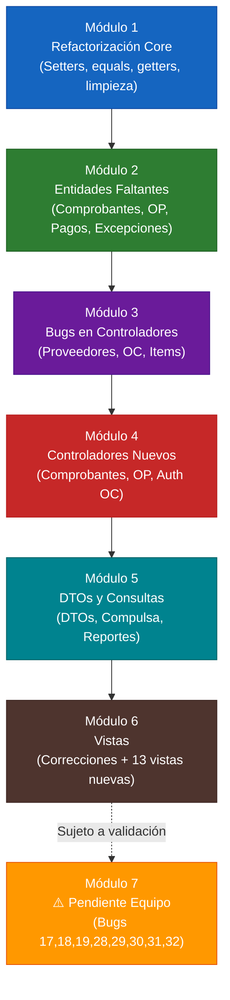

# Plan de Implementación — Refactorización y Completado del Sistema Farmared

## Contexto

Este plan aborda la refactorización integral del sistema "Farmared", un sistema de gestión de proveedores, compras y pagos desarrollado en Java Swing con arquitectura MVC + DTO. Se basa en el documento de auditoría [Analisis_Estado_Proyecto1.2.md](file:///c:/Users/pc/Desktop/Tpo_POO/Analisis_Estado_Proyecto1.2.md) que identificó **40+ bugs, errores de diseño y carencias estructurales**.

> [!IMPORTANT]
> Los **Bugs 17, 18, 19, 28, 29, 30, 31 y 32** están excluidos del flujo normal y agrupados en el **Módulo Final: Pendiente de Verificación del Equipo** (Módulo 7), según la restricción indicada por el equipo.

---

## Módulo 1: Refactorización Core del Modelo — Encapsulamiento, Setters y Contratos de Igualdad

**Objetivo:** Corregir las entidades del dominio para garantizar mutabilidad controlada, identidad semántica correcta y encapsulamiento. Este módulo es **prerequisito** de todos los demás.

### 1.1 Setters faltantes en entidades críticas

#### Bug 11 — `CuentaCorriente` sin `setTopeDeuda()`
**Archivo:** [CuentaCorriente.java](file:///c:/Users/pc/Desktop/Tpo_POO/TPO_POO_Grupo_11/src/main/java/Farmared/model/cuentaCorriente/CuentaCorriente.java)
**Acción:** Agregar setter con validación.
```java
public void setTopeDeuda(float topeDeuda) {
    if (topeDeuda < 0) throw new IllegalArgumentException("El tope de deuda no puede ser negativo");
    this.topeDeuda = topeDeuda;
}
```

#### Bug 22 — `Proveedor` sin `setFechaInicioActividades()`
**Archivo:** [Proveedor.java](file:///c:/Users/pc/Desktop/Tpo_POO/TPO_POO_Grupo_11/src/main/java/Farmared/model/proveedor/Proveedor.java)
**Acción:** Agregar setter.
```java
public void setFechaInicioActividades(Date fechaInicioActividades) {
    this.fechaInicioActividades = fechaInicioActividades;
}
```

#### Faltante — `Proveedor.setCuit()`
**Archivo:** [Proveedor.java](file:///c:/Users/pc/Desktop/Tpo_POO/TPO_POO_Grupo_11/src/main/java/Farmared/model/proveedor/Proveedor.java)
**Acción:** Agregar setter con re-validación de CUIT.
```java
public void setCuit(String cuit) {
    Validations.requireNotEmpty(cuit, "CUIT no puede estar vacío");
    if (!Validations.validCuit(cuit)) throw new IllegalArgumentException("CUIT inválido");
    this.cuit = cuit;
}
```

#### Bug 35 — `Item` sin setters
**Archivo:** [Item.java](file:///c:/Users/pc/Desktop/Tpo_POO/TPO_POO_Grupo_11/src/main/java/Farmared/model/item/Item.java)
**Acción:** Agregar setters para los 4 atributos mutables:
```java
public void setDescripcionDeItem(String descripcionDeItem) { this.descripcionDeItem = descripcionDeItem; }
public void setUnidadMedida(UnidadDeMedida unidadMedida) { this.unidadMedida = unidadMedida; }
public void setTipoDeIVA(TipoDeIVA tipoDeIVA) { this.tipoDeIVA = tipoDeIVA; }
public void setRubro(Rubro rubro) { this.rubro = rubro; }
```

#### Faltante — `Rubro` sin setters
**Archivo:** [Rubro.java](file:///c:/Users/pc/Desktop/Tpo_POO/TPO_POO_Grupo_11/src/main/java/Farmared/model/rubro/Rubro.java)
**Acción:** Agregar setters:
```java
public void setNombreRubro(String nombreRubro) { this.nombreRubro = nombreRubro; }
public void setTipoRubro(TipoRubro tipoRubro) { this.tipoRubro = tipoRubro; }
```

#### Faltante — `PrecioProveedor` sin setters
**Archivo:** [PrecioProveedor.java](file:///c:/Users/pc/Desktop/Tpo_POO/TPO_POO_Grupo_11/src/main/java/Farmared/model/precio/PrecioProveedor.java)
**Acción:** Agregar setter de precio (el ítem y proveedor son inmutables por diseño):
```java
public void setPrecio(float precio) {
    if (precio < 0) throw new IllegalArgumentException("El precio no puede ser negativo");
    this.precio = precio;
}
```

#### Faltante — `UnidadDeMedida` sin setters
**Archivo:** [UnidadDeMedida.java](file:///c:/Users/pc/Desktop/Tpo_POO/TPO_POO_Grupo_11/src/main/java/Farmared/model/item/UnidadDeMedida.java)
**Acción:** Agregar setters:
```java
public void setNombre(String nombre) { this.nombre = nombre; }
public void setTipoDeUnidad(TipoDeUnidad tipoDeUnidad) { this.tipoDeUnidad = tipoDeUnidad; }
```

#### Faltante — `OrdenDeCompra.getFechaEmision()` 
**Archivo:** [OrdenDeCompra.java](file:///c:/Users/pc/Desktop/Tpo_POO/TPO_POO_Grupo_11/src/main/java/Farmared/model/ordenCompra/OrdenDeCompra.java)
**Acción:** El campo `fechaEmision` existe pero carece de getter. Agregar:
```java
public Date getFechaEmision() { return this.fechaEmision; }
```

---

### 1.2 Sobreescritura de `equals()` y `hashCode()`

#### Bug 12 — `Item` sin `equals()`/`hashCode()`
**Archivo:** [Item.java](file:///c:/Users/pc/Desktop/Tpo_POO/TPO_POO_Grupo_11/src/main/java/Farmared/model/item/Item.java)
**Acción:** Implementar identidad basada en `codigoDeItem` (clave natural única generada por `GeneradorDeCodigos`):
```java
@Override
public boolean equals(Object o) {
    if (this == o) return true;
    if (o == null || !(o instanceof Item)) return false;
    Item item = (Item) o;
    return Objects.equals(codigoDeItem, item.codigoDeItem);
}

@Override
public int hashCode() {
    return Objects.hash(codigoDeItem);
}
```
**Impacto:** Corrige la comparación por referencia en `DetalleOC.obtenerPrecioProveedor()` (Bug 12).

#### Bug 33 — `Proveedor` sin `equals()`/`hashCode()`
**Archivo:** [Proveedor.java](file:///c:/Users/pc/Desktop/Tpo_POO/TPO_POO_Grupo_11/src/main/java/Farmared/model/proveedor/Proveedor.java)
**Acción:** Implementar identidad basada en `cuit` (clave natural única):
```java
@Override
public boolean equals(Object o) {
    if (this == o) return true;
    if (o == null || getClass() != o.getClass()) return false;
    Proveedor that = (Proveedor) o;
    return Objects.equals(cuit, that.cuit);
}

@Override
public int hashCode() {
    return Objects.hash(cuit);
}
```
**Impacto:** Corrige `existeProveedor()` en `ControladorDeOrdenDeCompra` que usa `.contains()`.

#### Faltante — `Rubro` sin `equals()`/`hashCode()`
**Archivo:** [Rubro.java](file:///c:/Users/pc/Desktop/Tpo_POO/TPO_POO_Grupo_11/src/main/java/Farmared/model/rubro/Rubro.java)
**Acción:** Implementar identidad basada en `codigoRubro`:
```java
@Override
public boolean equals(Object o) {
    if (this == o) return true;
    if (o == null || getClass() != o.getClass()) return false;
    Rubro rubro = (Rubro) o;
    return Objects.equals(codigoRubro, rubro.codigoRubro);
}

@Override
public int hashCode() {
    return Objects.hash(codigoRubro);
}
```
**Impacto:** Corrige `asociarRubro()` que depende de `.contains()` para evitar duplicados.

---

### 1.3 Getters faltantes y visibilidad incorrecta

#### Bug 6 — `ImpuestoRetenible` sin getters + tipo incorrecto de `minimoNoImponible`
**Archivo:** [ImpuestoRetenible.java](file:///c:/Users/pc/Desktop/Tpo_POO/TPO_POO_Grupo_11/src/main/java/Farmared/model/impuesto/ImpuestoRetenible.java)
**Acción:**
1. Cambiar el tipo de `minimoNoImponible` de `String` a `float`.
2. Agregar el parámetro al constructor: `ImpuestoRetenible(String nombre, float minimoNoImponible, List<RangoDeRetencion> rangos)`.
3. Agregar todos los getters:
```java
public String getNombre() { return nombre; }
public float getMinimoNoImponible() { return minimoNoImponible; }
public List<RangoDeRetencion> getRangos() { return Collections.unmodifiableList(rangos); }
```

#### Bug 8 — `ImpuestoRetenible.minimoNoImponible` inasignable
**Resolución:** Queda resuelto al cambiar el tipo a `float` y agregarlo al constructor (punto anterior). Adicionalmente agregar setter:
```java
public void setMinimoNoImponible(float minimoNoImponible) { this.minimoNoImponible = minimoNoImponible; }
```

#### Faltante — `CuentaCorriente.getComprobantes()`
**Archivo:** [CuentaCorriente.java](file:///c:/Users/pc/Desktop/Tpo_POO/TPO_POO_Grupo_11/src/main/java/Farmared/model/cuentaCorriente/CuentaCorriente.java)
**Acción:** Agregar getter defensivo:
```java
public List<Comprobante> getComprobantes() {
    return Collections.unmodifiableList(comprobantes);
}
```

#### Faltante — Visibilidad de `RangoDeRetencion` y `CertificadoNoRetencion`
**Archivos:** [RangoDeRetencion.java](file:///c:/Users/pc/Desktop/Tpo_POO/TPO_POO_Grupo_11/src/main/java/Farmared/model/impuesto/RangoDeRetencion.java) y [CertificadoNoRetencion.java](file:///c:/Users/pc/Desktop/Tpo_POO/TPO_POO_Grupo_11/src/main/java/Farmared/model/impuesto/CertificadoNoRetencion.java)
**Acción:** Cambiar `private` a `public` en:
- `RangoDeRetencion.estaEnRango()` → `public`
- `RangoDeRetencion.calcularRetencion()` → `public`
- `CertificadoNoRetencion.validarVigencia()` → `public`

---

### 1.4 Corrección de métodos con `return null` hardcodeado

#### Bug 9 — `RangoDeRetencion.estaEnRango()` y `calcularRetencion()` retornan null
**Archivo:** [RangoDeRetencion.java](file:///c:/Users/pc/Desktop/Tpo_POO/TPO_POO_Grupo_11/src/main/java/Farmared/model/impuesto/RangoDeRetencion.java)
**Acción:** Implementar la lógica real:
```java
public boolean estaEnRango(float monto) {
    return monto >= montoDesde && monto <= montoHasta;
}

public float calcularRetencion(float monto) {
    return monto * (porcentaje / 100f);
}
```
> [!NOTE]
> Cambiar el tipo de retorno de `Boolean` a `boolean` y de `float` (que retornaba null ilegalmente) a `float` primitivo. `estaEnRango()` ahora recibe el monto como parámetro. Agregar getters para `porcentaje`, `montoDesde`, `montoHasta`.

#### Bug 10 — `CertificadoNoRetencion.validarVigencia()` retorna null
**Archivo:** [CertificadoNoRetencion.java](file:///c:/Users/pc/Desktop/Tpo_POO/TPO_POO_Grupo_11/src/main/java/Farmared/model/impuesto/CertificadoNoRetencion.java)
**Acción:** Implementar la comparación de fechas:
```java
public boolean validarVigencia() {
    Date hoy = new Date();
    return !hoy.before(fechaInicio) && !hoy.after(fechaFin);
}
```

---

### 1.5 Métodos de encapsulamiento faltantes en `Proveedor`

**Archivo:** [Proveedor.java](file:///c:/Users/pc/Desktop/Tpo_POO/TPO_POO_Grupo_11/src/main/java/Farmared/model/proveedor/Proveedor.java)
**Acción:** Agregar métodos para manipular listas internas sin exponer la referencia:
```java
public void agregarImpuesto(ImpuestoRetenible impuesto) {
    if (!impuestosRetenibles.contains(impuesto)) {
        impuestosRetenibles.add(impuesto);
    }
}

public void agregarCertificado(CertificadoNoRetencion certificado) {
    certificadosNoRetencion.add(certificado);
}

public void eliminarPrecioItem(PrecioProveedor pp) {
    precioPorItem.remove(pp);
}
```

**Acción adicional en** [Item.java](file:///c:/Users/pc/Desktop/Tpo_POO/TPO_POO_Grupo_11/src/main/java/Farmared/model/item/Item.java):
```java
public void eliminarPrecio(PrecioProveedor pp) {
    precioItem.remove(pp);
}
```

---

### 1.6 Corrección de `Domicilio.toString()`

#### Bug 40
**Archivo:** [Domicilio.java](file:///c:/Users/pc/Desktop/Tpo_POO/TPO_POO_Grupo_11/src/main/java/Farmared/utils/Domicilio.java)
**Acción:** Completar el `toString()` incluyendo `ciudad` y `pais`:
```java
@Override
public String toString() {
    return calle + " " + numero + ", " + ciudad + ", " + pais + " (CP: " + codigoPostal + ")";
}
```

---

### 1.7 Limpieza de código muerto e imports innecesarios

#### Bug 25 — Import muerto en `ProveedorDTO`
**Archivo:** [ProveedorDTO.java](file:///c:/Users/pc/Desktop/Tpo_POO/TPO_POO_Grupo_11/src/main/java/Farmared/dto/proveedor/ProveedorDTO.java)
**Acción:** Eliminar `import Farmared.model.proveedor.Proveedor;`

#### Bug 37 — Imports muertos en `UsuarioDTO`
**Archivo:** [UsuarioDTO.java](file:///c:/Users/pc/Desktop/Tpo_POO/TPO_POO_Grupo_11/src/main/java/Farmared/dto/user/UsuarioDTO.java)
**Acción:** Eliminar `import Farmared.model.user.Rol;` e `import Farmared.model.user.Usuario;`

#### Bug 26 — Imports muertos en `Producto.java` y `Servicio.java`
**Archivos:** [Producto.java](file:///c:/Users/pc/Desktop/Tpo_POO/TPO_POO_Grupo_11/src/main/java/Farmared/model/item/Producto.java) y [Servicio.java](file:///c:/Users/pc/Desktop/Tpo_POO/TPO_POO_Grupo_11/src/main/java/Farmared/model/item/Servicio.java)
**Acción:** Eliminar imports de `PrecioProveedor`, `Rubro` y `ArrayList` que se usan en la clase padre `Item`.

#### Bug 5 — Campos muertos en `MenuPrincipal`
**Archivo:** [MenuPrincipal.java](file:///c:/Users/pc/Desktop/Tpo_POO/TPO_POO_Grupo_11/src/main/java/Farmared/MenuPrincipal.java)
**Acción:** Eliminar los `DefaultTableModel` para Proveedores, Productos y Servicios que nunca se usan.

#### Bug 24 — `estadosDeOC` código muerto
**Archivo:** [ControladorDeOrdenDeCompra.java](file:///c:/Users/pc/Desktop/Tpo_POO/TPO_POO_Grupo_11/src/main/java/Farmared/controller/ordenes/ControladorDeOrdenDeCompra.java)
**Acción:** Eliminar la declaración `List<EstadoOC> estadosDeOC`.

#### Bug 4 — `ProveedorDialog.java` huérfano
**Archivo:** [ProveedorDialog.java](file:///c:/Users/pc/Desktop/Tpo_POO/TPO_POO_Grupo_11/src/main/java/ProveedorDialog.java)
**Acción:** Eliminar este archivo. Es una versión vieja con datos mock que no pertenece al paquete `Farmared`.

#### Bug 14 — `ChequeDialog.java` vacío
**Archivo:** [ChequeDialog.java](file:///c:/Users/pc/Desktop/Tpo_POO/TPO_POO_Grupo_11/src/main/java/Farmared/view/ChequeDialog.java)
**Acción:** Eliminar el archivo vacío. Se recreará en el Módulo 2 como parte del módulo de medios de pago con su implementación completa.

#### Faltante — `OrdenDeCompra.reporteOC()` inútil
**Archivo:** [OrdenDeCompra.java](file:///c:/Users/pc/Desktop/Tpo_POO/TPO_POO_Grupo_11/src/main/java/Farmared/model/ordenCompra/OrdenDeCompra.java)
**Acción:** Eliminar el método `reporteOC()` que retorna `List.of(this)` sin utilidad. La funcionalidad de reportes se implementará como query en el controlador (Módulo 5).

---

### 1.8 Anti-patrones y Singleton

#### Bug 21 — `GeneradorDeCodigos` instanciado como objeto descartable
**Archivo:** [GeneradorDeCodigos.java](file:///c:/Users/pc/Desktop/Tpo_POO/TPO_POO_Grupo_11/src/main/java/Farmared/utils/GeneradorDeCodigos.java)
**Acción:** Refactorizar a clase utilitaria con métodos estáticos (ya usa un `Set` estático). Cambiar `generarCod()` a `static` y hacer el constructor privado:
```java
public class GeneradorDeCodigos {
    private static final Set<String> codigosGenerados = new HashSet<>();

    private GeneradorDeCodigos() {} // Prevenir instanciación

    public static String generarCod(String tipo) {
        // ... lógica existente sin cambios ...
    }
}
```
**Impacto:** Reemplazar todas las llamadas `new GeneradorDeCodigos().generarCod(...)` por `GeneradorDeCodigos.generarCod(...)` en los controladores.

#### Faltante — Anti-patrón en `UtilDate`
**Archivo:** [UtilDate.java](file:///c:/Users/pc/Desktop/Tpo_POO/TPO_POO_Grupo_11/src/main/java/Farmared/utils/UtilDate.java)
**Acción:** El método `parseDate()` ya es `static`. Corregir las invocaciones en `ControladorProveedores.toDTO()` eliminando `new UtilDate()` y llamando directamente `UtilDate.parseDate(...)`. Además, agregar el método faltante de parseo inverso:
```java
public static Date toDate(String fechaStr) {
    try {
        SimpleDateFormat sdf = new SimpleDateFormat("dd/MM/yyyy");
        sdf.setLenient(false);
        return sdf.parse(fechaStr);
    } catch (ParseException e) {
        throw new IllegalArgumentException("Formato de fecha inválido. Use dd/MM/yyyy");
    }
}
```

---

## Módulo 2: Implementación de Entidades Faltantes del Modelo

**Objetivo:** Crear todas las clases del dominio exigidas por los diagramas de secuencia de Fase 1 que actualmente no existen.

### 2.1 Módulo de Comprobantes

#### Enum `EstadoComprobante` [NUEVO]
**Crear:** `Farmared/model/comprobante/EstadoComprobante.java`
```java
public enum EstadoComprobante {
    PENDIENTE, AUTORIZADO, PARCIALMENTE_PAGADO, PAGADO, ANULADO
}
```

#### Clase `Factura` [NUEVA] — Extiende `Comprobante`
**Crear:** `Farmared/model/comprobante/Factura.java`
- Campos adicionales: `OrdenDeCompra ordenDeCompra`, `List<DetalleComprobante> detalles`
- Métodos: `agregarDetalle()`, `calcularSubTotal()`, `calcularTotal()`, `getOrdenDeCompra()`
- La factura suma a la deuda en cuenta corriente.

#### Clase `NotaCredito` [NUEVA] — Extiende `Comprobante`
**Crear:** `Farmared/model/comprobante/NotaCredito.java`
- Campo adicional: `Factura facturaAsociada`
- La nota de crédito resta a la deuda en cuenta corriente.

#### Clase `NotaDebito` [NUEVA] — Extiende `Comprobante`
**Crear:** `Farmared/model/comprobante/NotaDebito.java`
- La nota de débito suma a la deuda en cuenta corriente.

#### Clase `DetalleComprobante` [NUEVA]
**Crear:** `Farmared/model/comprobante/DetalleComprobante.java`
- Campos: `Item item`, `int cantidad`, `float precioFacturado`, `float subTotal`
- Método: `calcularSubTotal()` → `cantidad * precioFacturado`

#### Refactorización de `Comprobante.java` existente
**Archivo:** [Comprobante.java](file:///c:/Users/pc/Desktop/Tpo_POO/TPO_POO_Grupo_11/src/main/java/Farmared/model/comprobante/Comprobante.java)
**Acción:** Agregar campo `EstadoComprobante estado` al constructor y métodos `getEstado()`, `setEstado()`. Agregar asociación referencial con `OrdenDeCompra` para trazabilidad. Hacer la clase `abstract` si es pertinente (ya que siempre se instancia como Factura, NC o ND).

---

### 2.2 Módulo de Órdenes de Pago y Medios de Pago

#### Clase abstracta `FormaDePago` [NUEVA]
**Crear:** `Farmared/model/pago/FormaDePago.java`
- Campos comunes: `float monto`, `Date fecha`
- Métodos abstractos: ninguno obligatorio; getter/setter de `monto` y `fecha`.

#### Clase `Cheque` [NUEVA] — Extiende `FormaDePago`
**Crear:** `Farmared/model/pago/Cheque.java`
- Campos: `String nroCheque`, `Date fechaEmision`, `Date fechaVencimiento`, `String banco`, `String firmante`
- Getters y setters completos.

#### Clase `Transferencia` [NUEVA] — Extiende `FormaDePago`
**Crear:** `Farmared/model/pago/Transferencia.java`
- Campos: `String cbu`, `String bancoDestino`, `String nroTransferencia`
- Getters y setters.

#### Clase `Efectivo` [NUEVA] — Extiende `FormaDePago`
**Crear:** `Farmared/model/pago/Efectivo.java`
- Hereda `monto` y `fecha` de `FormaDePago`. Sin campos adicionales.

#### Clase `OrdenDePago` [NUEVA]
**Crear:** `Farmared/model/pago/OrdenDePago.java`
- Campos: `int nroOP`, `Date fechaEmision`, `Proveedor proveedor`, `float totalBruto`, `float totalRetenciones`, `float totalNeto`, `List<DetalleCancelacion> detallesCancelacion`, `List<FormaDePago> formasDePago`
- Métodos: `agregarDetalleCancelacion()`, `agregarFormaDePago()`, `calcularTotalNeto()`

#### Clase `DetalleCancelacion` [NUEVA]
**Crear:** `Farmared/model/pago/DetalleCancelacion.java`
- Campos: `Comprobante comprobante`, `float montoCancelado`
- Permite cancelaciones parciales (si `montoCancelado < comprobante.getTotal()`) o totales.

---

### 2.3 Corrección de `CuentaCorriente` — Lógica de deuda

#### Bug 3 — `CuentaCorriente` nunca actualiza `deudaActual`
**Archivo:** [CuentaCorriente.java](file:///c:/Users/pc/Desktop/Tpo_POO/TPO_POO_Grupo_11/src/main/java/Farmared/model/cuentaCorriente/CuentaCorriente.java)
**Acción:** Refactorizar `agregarComprobante()` para que actualice `deudaActual` según el tipo de comprobante:
```java
public void agregarComprobante(Comprobante c) {
    comprobantes.add(c);
    if (c instanceof Factura || c instanceof NotaDebito) {
        deudaActual += c.getTotal();
    } else if (c instanceof NotaCredito) {
        deudaActual -= c.getTotal();
    }
}
```
**Impacto:** `calcularDeuda()` ahora reflejará el saldo real. Las validaciones de tope de deuda en OC funcionarán correctamente.

---

### 2.4 Jerarquía de Excepciones del Dominio

**Crear paquete:** `Farmared/exception/`
- `FarmaredException.java` — Excepción base del dominio (`extends RuntimeException`)
- `ProveedorNoEncontradoException.java`
- `ItemNoEncontradoException.java`
- `TopeDeudaExcedidoException.java`
- `AutorizacionRequeridaException.java`
- `ComprobanteInvalidoException.java`
- `DiferenciaDePrecioException.java`

Refactorizar los controladores para que lancen estas excepciones de dominio en lugar de `Exception`/`RuntimeException` genéricas.

---

## Módulo 3: Corrección de Bugs en Controladores Existentes

**Objetivo:** Corregir los bugs funcionales en los 4 controladores existentes antes de crear los nuevos.

### 3.1 `ControladorProveedores`

#### Bug 1 — `modificarProveedor()` ignora el tope de deuda
**Archivo:** [ControladorProveedores.java](file:///c:/Users/pc/Desktop/Tpo_POO/TPO_POO_Grupo_11/src/main/java/Farmared/controller/proveedores/ControladorProveedores.java)
**Acción:** Reemplazar la línea que solo lee `getTopeDeuda()` por la escritura real:
```java
// ANTES (Bug):
proveedor.getCuentaCorriente().getTopeDeuda();
// DESPUÉS (Fix):
proveedor.getCuentaCorriente().setTopeDeuda(dto.getTopeDeuda());
```

#### Bug 13 — `toModel()` ignora la fecha del DTO
**Archivo:** [ControladorProveedores.java](file:///c:/Users/pc/Desktop/Tpo_POO/TPO_POO_Grupo_11/src/main/java/Farmared/controller/proveedores/ControladorProveedores.java)
**Acción:** Reemplazar `new Date()` por parseo del string del DTO:
```java
// ANTES:
Date fechaInicioActividades = new Date();
// DESPUÉS:
Date fechaInicioActividades = UtilDate.toDate(dto.getFechaInicioActividades());
```

#### Bug 34 — `registrarProveedor()` bypasea `asociarRubro()`
**Archivo:** [ControladorProveedores.java](file:///c:/Users/pc/Desktop/Tpo_POO/TPO_POO_Grupo_11/src/main/java/Farmared/controller/proveedores/ControladorProveedores.java)
**Acción:** Reemplazar acceso directo al ArrayList:
```java
// ANTES:
nuevo.getRubroProveedor().add(r);
// DESPUÉS:
nuevo.asociarRubro(r);
```

#### Bug 38 — `registrarPrecioProveedor()` viola encapsulamiento
**Archivo:** [ControladorProveedores.java](file:///c:/Users/pc/Desktop/Tpo_POO/TPO_POO_Grupo_11/src/main/java/Farmared/controller/proveedores/ControladorProveedores.java)
**Acción:** Reemplazar acceso directo a listas internas:
```java
// ANTES:
prov.getPrecioPorItem().add(nuevoPrecio);
item.getPrecioItem().add(nuevoPrecio);
// DESPUÉS:
prov.agregarPrecioItem(nuevoPrecio);
item.agregarPrecio(nuevoPrecio);
```

#### Bug 39 — `eliminarProveedor()` no verifica referencias activas
**Archivo:** [ControladorProveedores.java](file:///c:/Users/pc/Desktop/Tpo_POO/TPO_POO_Grupo_11/src/main/java/Farmared/controller/proveedores/ControladorProveedores.java)
**Acción:** Antes de eliminar, verificar integridad referencial:
```java
public void eliminarProveedor(String cuit) {
    Proveedor prov = buscarProveedorModelo(cuit);
    if (prov == null) throw new ProveedorNoEncontradoException(cuit);

    // Verificar OC activas
    ControladorDeOrdenDeCompra ctrlOC = ControladorDeOrdenDeCompra.getInstance();
    boolean tieneOCActivas = ctrlOC.tieneOrdenesActivas(cuit); // método a crear en Módulo 3.2
    if (tieneOCActivas) {
        throw new FarmaredException("No se puede eliminar: el proveedor tiene OC activas");
    }

    // Verificar deuda pendiente
    if (prov.getCuentaCorriente().getDeudaActual() > 0) {
        throw new FarmaredException("No se puede eliminar: el proveedor tiene deuda pendiente");
    }

    // Limpiar precios asociados
    for (PrecioProveedor pp : new ArrayList<>(prov.getPrecioPorItem())) {
        pp.getItem().eliminarPrecio(pp);
    }
    proveedores.remove(prov);
}
```

#### Anti-patrón — Instanciación innecesaria de `UtilDate`
**Acción:** En `toDTO()`, reemplazar `new UtilDate().parseDate(...)` por `UtilDate.parseDate(...)`.

---

### 3.2 `ControladorDeOrdenDeCompra`

#### Bug 7 — `emitirOC()` crea OCs vacías (código comentado)
**Archivo:** [ControladorDeOrdenDeCompra.java](file:///c:/Users/pc/Desktop/Tpo_POO/TPO_POO_Grupo_11/src/main/java/Farmared/controller/ordenes/ControladorDeOrdenDeCompra.java)
**Acción:** Descomentar y refactorizar `emitirOC()` para que reciba una lista de ítems con cantidades:
```java
public OrdenDeCompraDTO emitirOC(String cuitProveedor, List<DetalleItemDTO> items, String legajoCreador) {
    Proveedor prov = ControladorProveedores.getInstance().buscarProveedorModelo(cuitProveedor);
    Validations.requireNotNull(prov, "Proveedor no encontrado");

    Usuario creador = ControladorUsuariosYSeguridad.getInstance().buscarPorLegajo(legajoCreador);
    
    int nroOC = ordenes.size() + 1;
    OrdenDeCompra oc = new OrdenDeCompra(nroOC, new Date(), prov);
    oc.setCreador(creador);

    for (DetalleItemDTO detalle : items) {
        Item item = ControladorProductosYServicios.getInstance().buscarItemModeloPorCodigo(detalle.getCodigoItem());
        Validations.requireNotNull(item, "Ítem no encontrado: " + detalle.getCodigoItem());
        oc.crearDetalle(item, detalle.getCantidad());
    }
    
    // Calcular total de la OC
    float total = calcularTotalOC(oc);
    
    // Validar tope de deuda
    float deudaActual = prov.getCuentaCorriente().calcularDeuda();
    float tope = prov.getCuentaCorriente().getTopeDeuda();
    
    if (validarLimite(deudaActual, total, tope)) {
        oc.setEstadoOC(EstadoOC.EMITIDA);
    } else {
        oc.setEstadoOC(EstadoOC.PENDIENTE_AUTORIZACION);
    }
    
    ordenes.add(oc);
    return toDTO(oc);
}
```

**Método auxiliar a agregar:**
```java
public boolean tieneOrdenesActivas(String cuit) {
    return ordenes.stream()
        .anyMatch(oc -> oc.getProveedor().getCuit().equals(cuit)
            && (oc.getEstadoOC() == EstadoOC.EMITIDA || oc.getEstadoOC() == EstadoOC.PENDIENTE_AUTORIZACION));
}
```

---

### 3.3 `ControladorProductosYServicios`

#### Bug 2 — `registrarItem()` SIEMPRE falla (lista de unidades vacía)
**Archivo:** [ControladorProductosYServicios.java](file:///c:/Users/pc/Desktop/Tpo_POO/TPO_POO_Grupo_11/src/main/java/Farmared/controller/item/ControladorProductosYServicios.java)
**Acción:** Implementar el método `registrarUnidadDeMedida()` que falta:
```java
public void registrarUnidadDeMedida(String nombre, String tipoDeUnidad) {
    TipoDeUnidad tipo = TipoDeUnidad.valueOf(tipoDeUnidad);
    String codigo = GeneradorDeCodigos.generarCod("UNI");
    UnidadDeMedida unidad = new UnidadDeMedida(codigo, nombre, tipo);
    unidadesDeMedida.add(unidad);
}
```
**Métodos adicionales faltantes:**
```java
public void eliminarItem(String codigoItem) {
    Item item = buscarItemModeloPorCodigo(codigoItem);
    Validations.requireNotNull(item, "Ítem no encontrado");
    // Verificar que no tenga precios asociados activos
    if (!item.getPrecioItem().isEmpty()) {
        throw new FarmaredException("No se puede eliminar: el ítem tiene precios asociados");
    }
    items.remove(item);
}

public void eliminarRubro(String codigoRubro) {
    Rubro rubro = buscarRubroPorCodigo(codigoRubro);
    Validations.requireNotNull(rubro, "Rubro no encontrado");
    // Verificar que ningún ítem use este rubro
    boolean enUso = items.stream().anyMatch(i -> i.getRubro().equals(rubro));
    if (enUso) throw new FarmaredException("No se puede eliminar: hay ítems asociados a este rubro");
    rubros.remove(rubro);
}

public List<UnidadDeMedida> listarUnidades() {
    return Collections.unmodifiableList(unidadesDeMedida);
}
```

---

## Módulo 4: Construcción de Controladores Orquestadores Faltantes

**Objetivo:** Crear los dos controladores exigidos por los diagramas de secuencia de Fase 1.

### 4.1 `ControladorDeComprobantesRecibidos` [NUEVO]

**Crear:** `Farmared/controller/comprobantes/ControladorDeComprobantesRecibidos.java`

**Patrón:** Singleton sincronizado (consistente con los demás controladores).

**Responsabilidades:**
1. **`registrarFactura(FacturaDTO dto)`**: Orquesta el flujo:
   - Buscar el proveedor por CUIT (delega a `ControladorProveedores`).
   - Buscar la OC asociada por número (delega a `ControladorDeOrdenDeCompra`).
   - Crear la instancia `Factura` con sus `DetalleComprobante`.
   - **Validar precios contra la OC:** Iterar cada detalle de la factura y comparar el precio facturado con el precio de la OC. Si hay diferencia, lanzar `DiferenciaDePrecioException` para que un Supervisor autorice.
   - Agregar el comprobante a la `CuentaCorriente` del proveedor (lo que automáticamente actualiza `deudaActual` gracias al fix del Módulo 2.3).
   - Retornar `ComprobanteDTO`.

2. **`registrarNotaCredito(NotaCreditoDTO dto)`** y **`registrarNotaDebito(NotaDebitoDTO dto)`**: Flujo similar sin validación contra OC.

3. **`listarComprobantesPorProveedor(String cuit)`**: Retorna `List<ComprobanteDTO>`.

4. **`autorizarDiferenciaPrecio(int nroComprobante, String legajoSupervisor)`**: Permite a un supervisor aprobar una factura con diferencia de precio.

---

### 4.2 `ControladorDeOrdenesDePago` [NUEVO]

**Crear:** `Farmared/controller/pagos/ControladorDeOrdenesDePago.java`

**Patrón:** Singleton sincronizado.

**Responsabilidades:**
1. **`emitirOrdenDePago(OrdenDePagoDTO dto)`**: Orquesta el flujo completo:
   - Buscar el proveedor.
   - Seleccionar comprobantes pendientes de pago del proveedor.
   - **Calcular retenciones** por cada `ImpuestoRetenible` del proveedor:
     - Verificar si el proveedor tiene `CertificadoNoRetencion` vigente para ese impuesto (usando `validarVigencia()`).
     - Si no tiene certificado, buscar el `RangoDeRetencion` correspondiente al monto y calcular la retención (`estaEnRango()` + `calcularRetencion()`).
   - Crear `DetalleCancelacion` por cada comprobante (total o parcial).
   - Registrar los medios de pago (`Cheque`, `Transferencia`, `Efectivo`).
   - Crear la `OrdenDePago` con el total neto (bruto − retenciones).
   - Actualizar el estado de los comprobantes cancelados.

2. **`listarOrdenesDePago()`** y **`buscarOrdenDePago(int nroOP)`**: Consultas.

3. **`calcularRetenciones(Proveedor prov, float montoBruto)`**: Lógica de cálculo de retenciones.

---

### 4.3 Ampliación de `ControladorUsuariosYSeguridad`

**Archivo:** [ControladorUsuariosYSeguridad.java](file:///c:/Users/pc/Desktop/Tpo_POO/TPO_POO_Grupo_11/src/main/java/Farmared/controller/usuariosYSeguridad/ControladorUsuariosYSeguridad.java)
**Acción:** Agregar métodos faltantes:
```java
public void modificarUsuario(UsuarioDTO dto) { /* buscar por legajo, actualizar campos */ }
public void eliminarUsuario(String legajo) { /* buscar y remover */ }
public List<UsuarioDTO> listarUsuarios() { /* convertir lista a DTOs */ }
```

---

### 4.4 Flujo de Autorización de OC por Supervisor

**Ampliar:** [ControladorDeOrdenDeCompra.java](file:///c:/Users/pc/Desktop/Tpo_POO/TPO_POO_Grupo_11/src/main/java/Farmared/controller/ordenes/ControladorDeOrdenDeCompra.java)
**Acción:** Agregar método de autorización:
```java
public void autorizarOC(int nroOC, String legajoSupervisor) {
    OrdenDeCompra oc = buscarOCPorNumero(nroOC);
    Validations.requireNotNull(oc, "OC no encontrada");

    if (oc.getEstadoOC() != EstadoOC.PENDIENTE_AUTORIZACION) {
        throw new FarmaredException("La OC no está pendiente de autorización");
    }

    Usuario supervisor = ControladorUsuariosYSeguridad.getInstance().buscarPorLegajo(legajoSupervisor);
    if (supervisor.getRol() != Rol.SUPERVISOR) {
        throw new FarmaredException("Solo un supervisor puede autorizar OCs");
    }

    Autorizacion auth = new Autorizacion(oc.getCreador(), oc);
    auth.setSupervisor(supervisor);
    oc.setEstadoOC(EstadoOC.EMITIDA);
}
```

---

## Módulo 5: Creación de DTOs Faltantes y Lógica de Consultas

**Objetivo:** Completar la capa de transferencia y agregar la lógica de reportes/consultas.

### 5.1 DTOs Faltantes

#### `OrdenDeCompraDTO` [NUEVO]
**Crear:** `Farmared/dto/ordenes/OrdenDeCompraDTO.java`
- Campos: `int nroOC`, `String fechaEmision`, `String cuitProveedor`, `String razonSocial`, `String estado`, `float total`, `String creador`, `List<DetalleOCDTO> detalles`

#### `DetalleOCDTO` [NUEVO]
**Crear:** `Farmared/dto/ordenes/DetalleOCDTO.java`
- Campos: `String codigoItem`, `String descripcionItem`, `int cantidad`, `float precioUnitario`, `float subtotal`

#### `DetalleItemDTO` [NUEVO]
**Crear:** `Farmared/dto/ordenes/DetalleItemDTO.java`
- Campos: `String codigoItem`, `int cantidad` — Usado como input para `emitirOC()`.

#### `CuentaCorrienteDTO` [NUEVO]
**Crear:** `Farmared/dto/proveedor/CuentaCorrienteDTO.java`
- Campos: `float topeDeuda`, `float deudaActual`, `List<ComprobanteDTO> comprobantes`

#### `ComprobanteDTO` [NUEVO]
**Crear:** `Farmared/dto/comprobantes/ComprobanteDTO.java`
- Campos: `int nroComprobante`, `String fecha`, `String tipo` (Factura/NC/ND), `float total`, `String estado`

#### `OrdenDePagoDTO` [NUEVO]
**Crear:** `Farmared/dto/pagos/OrdenDePagoDTO.java`
- Campos: `int nroOP`, `String fechaEmision`, `String cuitProveedor`, `float totalBruto`, `float totalRetenciones`, `float totalNeto`, `List<String> formasDePago`

#### `PrecioProveedorDTO` [NUEVO]
**Crear:** `Farmared/dto/precio/PrecioProveedorDTO.java`
- Campos: `String cuitProveedor`, `String razonSocial`, `String codigoItem`, `String descripcionItem`, `float precio`
- **Necesario para la Compulsa de Precios.**

---

### 5.2 Corrección de `cuentaCorriente()` en el controlador

**Archivo:** [ControladorDeOrdenDeCompra.java](file:///c:/Users/pc/Desktop/Tpo_POO/TPO_POO_Grupo_11/src/main/java/Farmared/controller/ordenes/ControladorDeOrdenDeCompra.java)
**Acción:** Refactorizar para que retorne un DTO en vez del modelo:
```java
public CuentaCorrienteDTO cuentaCorriente(String cuit) {
    Proveedor prov = ControladorProveedores.getInstance().buscarProveedorModelo(cuit);
    CuentaCorriente cc = prov.getCuentaCorriente();
    // Convertir comprobantes a DTOs
    List<ComprobanteDTO> comprobantesDTO = /* mapear cc.getComprobantes() a DTOs */;
    return new CuentaCorrienteDTO(cc.getTopeDeuda(), cc.getDeudaActual(), comprobantesDTO);
}
```

---

### 5.3 Compulsa de Precios

**Ampliar:** [ControladorProductosYServicios.java](file:///c:/Users/pc/Desktop/Tpo_POO/TPO_POO_Grupo_11/src/main/java/Farmared/controller/item/ControladorProductosYServicios.java)
**Acción:** Agregar método de compulsa:
```java
public List<PrecioProveedorDTO> compulsaDePrecios(String codigoItem) {
    Item item = buscarItemModeloPorCodigo(codigoItem);
    Validations.requireNotNull(item, "Ítem no encontrado");
    return item.getPrecioItem().stream()
        .sorted(Comparator.comparing(PrecioProveedor::getPrecio))
        .map(pp -> new PrecioProveedorDTO(
            pp.getProveedor().getCuit(),
            pp.getProveedor().getRazonSocial(),
            item.getCodigoDeItem(),
            item.getDescripcionDeItem(),
            pp.getPrecio()))
        .collect(Collectors.toList());
}
```

---

### 5.4 Módulo de Reportes

**Ampliar controladores existentes con métodos de consulta:**

- `ControladorDeComprobantesRecibidos.libroIVACompras(String fechaDesde, String fechaHasta)`: Filtra facturas por rango de fechas, calcula IVA por tipo.
- `ControladorDeOrdenesDePago.totalRetenidoPorImpuesto(String fechaDesde, String fechaHasta)`: Agrupa retenciones por tipo de impuesto.
- `ControladorDeOrdenesDePago.listadoComprobantesImpagos(String cuitProveedor)`: Filtra comprobantes con estado `PENDIENTE`.
- `ControladorProveedores.consultaCuentaCorriente(String cuit)`: Retorna `CuentaCorrienteDTO` detallada.

---

## Módulo 6: Corrección de Vistas Existentes y Construcción de Vistas Faltantes

**Objetivo:** Corregir las vistas que tienen errores de enum/diseño y construir todas las pantallas faltantes.

### 6.1 Correcciones de Vistas Existentes

#### Bug 15 — `VistaAltaRubro` con enum inválido `"SERVICIO"`
**Archivo:** [VistaAltaRubro.java](file:///c:/Users/pc/Desktop/Tpo_POO/TPO_POO_Grupo_11/src/main/java/Farmared/view/rubro/VistaAltaRubro.java)
**Acción:** Cambiar `"SERVICIO"` por `"SERVICIOS"` en el combo de tipo de rubro, o mejor aún, poblar el combo directamente desde el enum:
```java
JComboBox<String> comboTipo = new JComboBox<>(
    Arrays.stream(TipoRubro.values()).map(Enum::name).toArray(String[]::new)
);
```

#### Bug 16 — `UnidadDialog` con código manual y combos incompatibles
**Archivo:** [UnidadDialog.java](file:///c:/Users/pc/Desktop/Tpo_POO/TPO_POO_Grupo_11/src/main/java/Farmared/view/UnidadDialog.java)
**Acción:**
1. Eliminar el campo `txtCodigo` (el código se autogenera en el modelo).
2. Reemplazar el combo hardcodeado por valores del enum:
```java
JComboBox<String> comboTipo = new JComboBox<>(
    Arrays.stream(TipoDeUnidad.values()).map(Enum::name).toArray(String[]::new)
);
```
3. Conectar el botón Guardar al controlador: `ControladorProductosYServicios.getInstance().registrarUnidadDeMedida(nombre, tipoSeleccionado);`

#### Bug 27 — Combos de IVA en `ProductoDialog` y `ServicioDialog` no coinciden con enum
**Archivos:** [ProductoDialog.java](file:///c:/Users/pc/Desktop/Tpo_POO/TPO_POO_Grupo_11/src/main/java/Farmared/view/ProductoDialog.java) y [ServicioDialog.java](file:///c:/Users/pc/Desktop/Tpo_POO/TPO_POO_Grupo_11/src/main/java/Farmared/view/ServicioDialog.java)
**Acción:** Reemplazar los combos hardcodeados `{"21%", "10.5%", "Exento"}` por valores del enum `TipoDeIVA`:
```java
JComboBox<String> comboIVA = new JComboBox<>(
    Arrays.stream(TipoDeIVA.values()).map(Enum::name).toArray(String[]::new)
);
```

#### Error de diseño — `txtPrecio` en `ProductoDialog` y `ServicioDialog`
**Archivos:** [ProductoDialog.java](file:///c:/Users/pc/Desktop/Tpo_POO/TPO_POO_Grupo_11/src/main/java/Farmared/view/ProductoDialog.java) y [ServicioDialog.java](file:///c:/Users/pc/Desktop/Tpo_POO/TPO_POO_Grupo_11/src/main/java/Farmared/view/ServicioDialog.java)
**Acción:** Eliminar el campo `txtPrecio`. El precio no es un atributo del ítem sino de la relación `PrecioProveedor`. Se registra desde la pantalla de `registrarPrecioProveedor()` (a crear en 6.2).

#### Bug 20 — `OrdenDePagoDialog` cosmético
**Archivo:** [OrdenDePagoDialog.java](file:///c:/Users/pc/Desktop/Tpo_POO/TPO_POO_Grupo_11/src/main/java/Farmared/view/OrdenDePagoDialog.java)
**Acción:** Reescribir completamente para conectar con `ControladorDeOrdenesDePago` (se aborda en 6.2 como vista nueva).

#### Faltante — `VistaAltaProveedor` sin campo `fechaInicioActividades`
**Archivo:** [VistaAltaProveedor.java](file:///c:/Users/pc/Desktop/Tpo_POO/TPO_POO_Grupo_11/src/main/java/Farmared/view/proveedorGUI/VistaAltaProveedor.java)
**Acción:** Agregar un `JTextField` (o `JFormattedTextField` con máscara `dd/MM/yyyy`) para la fecha de inicio de actividades y pasarlo al `ProveedorDTO`.

---

### 6.2 Vistas Completamente Nuevas a Crear

> [!NOTE]
> Cada vista debe seguir el patrón existente: JDialog o JPanel que se comunica **exclusivamente** mediante DTOs y controladores. Nunca accede al modelo directamente.

| # | Vista | Descripción | Controlador destino |
|---|-------|-------------|---------------------|
| 1 | `VistaEmisionOC` | Seleccionar proveedor, agregar ítems con cantidad, ver total, emitir | `ControladorDeOrdenDeCompra` |
| 2 | `VistaRecepcionComprobantes` | Cargar factura asociada a una OC, ver alertas de diferencia de precio | `ControladorDeComprobantesRecibidos` |
| 3 | `VistaOrdenDePago` | Reescritura de `OrdenDePagoDialog`: seleccionar proveedor, ver comprobantes pendientes, calcular retenciones, agregar medios de pago | `ControladorDeOrdenesDePago` |
| 4 | `VistaChequeDialog` | Formulario para datos del cheque (reemplaza el archivo vacío Bug 14) | Embebido en `VistaOrdenDePago` |
| 5 | `VistaGestionImpositiva` | Parametrizar impuestos, cargar certificados de no retención | `ControladorDeComprobantesRecibidos` / nuevo |
| 6 | `VistaGestionUsuarios` | Alta, modificación, baja y listado de usuarios | `ControladorUsuariosYSeguridad` |
| 7 | `VistaCuentaCorriente` | Consulta de CC de un proveedor: tope, deuda, comprobantes | `ControladorDeOrdenDeCompra` |
| 8 | `VistaRegistroPrecioProveedor` | Asociar proveedor + ítem + precio | `ControladorProveedores` |
| 9 | `VistaCompulsaPrecios` | Seleccionar ítem, ver tabla comparativa de precios por proveedor | `ControladorProductosYServicios` |
| 10 | `VistaReportes` | Panel con tabs para Libro IVA, deudas, retenciones, impagos | Múltiples controladores |
| 11 | `VistaModificarItem` | Formulario para editar un ítem existente | `ControladorProductosYServicios` |
| 12 | `VistaModificarRubro` | Formulario para editar un rubro existente | `ControladorProductosYServicios` |
| 13 | `VistaListadoUnidades` | Tabla de unidades de medida cargadas | `ControladorProductosYServicios` |

#### Integración en `MenuPrincipal`
- Agregar nuevas pestañas/botones para acceder a las vistas de OC, Comprobantes, OP, Reportes y Usuarios.
- Agregar botón de **Logout / Cambio de usuario** que vuelva a `LoginGUI`.
- Eliminar datos mock del panel de Órdenes de Pago (Bug 31 — ver Módulo 7).

---

## Módulo 7 (FINAL): Pendiente de Verificación del Equipo

> [!CAUTION]
> Los siguientes bugs están **sujetos a validación con el resto del equipo de desarrollo**. NO deben incluirse en el flujo normal de trabajo hasta que el equipo confirme la línea de acción.

---

### Bug 17 — `altaUsuario()` hardcodea la contraseña `"1415"`
**Archivo:** [ControladorUsuariosYSeguridad.java](file:///c:/Users/pc/Desktop/Tpo_POO/TPO_POO_Grupo_11/src/main/java/Farmared/controller/usuariosYSeguridad/ControladorUsuariosYSeguridad.java)
**Estado:** ⏸️ Pendiente de decisión del equipo.
**Análisis:** Actualmente en `altaUsuario()` se construye el `Usuario` con password fija `"1415"`. Esto impide que cada usuario tenga una contraseña propia.
**Plan de acción propuesto (sujeto a confirmación):**
- Agregar un parámetro `String password` a la firma de `altaUsuario()`.
- Propagar el valor recibido desde la vista (previa creación de `VistaGestionUsuarios` con campo de contraseña).
- Considerar si se requiere hashing de la contraseña o si se mantiene en texto plano (decisión de equipo).
**Dependencia directa:** Bug 32 (setter privado).

---

### Bug 18 — `ProductoDialog` y `UnidadDialog` mockeados (no invocan controladores)
**Archivos:** [ProductoDialog.java](file:///c:/Users/pc/Desktop/Tpo_POO/TPO_POO_Grupo_11/src/main/java/Farmared/view/ProductoDialog.java) y [UnidadDialog.java](file:///c:/Users/pc/Desktop/Tpo_POO/TPO_POO_Grupo_11/src/main/java/Farmared/view/UnidadDialog.java)
**Estado:** ⏸️ Pendiente de decisión del equipo.
**Análisis:** Ambos diálogos muestran `JOptionPane("¡Guardado!")` sin invocar ningún controlador. Los datos ingresados se pierden.
**Plan de acción propuesto:**
- `ProductoDialog`: Conectar el botón Guardar a `ControladorProductosYServicios.getInstance().registrarItem(desc, codUnidad, tipoIVA, codRubro, "PRODUCTO")`.
- `UnidadDialog`: Conectar a `ControladorProductosYServicios.getInstance().registrarUnidadDeMedida(nombre, tipo)`.
- Validar si el equipo prefiere reescribir estos diálogos o parchear los existentes.

---

### Bug 19 — `ServicioDialog` mockeado (no invoca controladores)
**Archivo:** [ServicioDialog.java](file:///c:/Users/pc/Desktop/Tpo_POO/TPO_POO_Grupo_11/src/main/java/Farmared/view/ServicioDialog.java)
**Estado:** ⏸️ Pendiente de decisión del equipo.
**Análisis:** Mismo problema que Bug 18 pero para servicios.
**Plan de acción propuesto:**
- Conectar el botón Guardar a `ControladorProductosYServicios.getInstance().registrarItem(desc, codUnidad, tipoIVA, codRubro, "SERVICIO")`.
- Verificar con el equipo si se mantiene la misma estructura de diálogo o se refactoriza.

---

### Bug 28 — Combos de rubros en `ProductoDialog` y `ServicioDialog` son hardcodeados
**Archivos:** [ProductoDialog.java](file:///c:/Users/pc/Desktop/Tpo_POO/TPO_POO_Grupo_11/src/main/java/Farmared/view/ProductoDialog.java) y [ServicioDialog.java](file:///c:/Users/pc/Desktop/Tpo_POO/TPO_POO_Grupo_11/src/main/java/Farmared/view/ServicioDialog.java)
**Estado:** ⏸️ Pendiente de decisión del equipo.
**Análisis:** Los combos usan valores fijos (`"Medicamentos"`, `"Higiene"`, `"Cosmética"` / `"Mantenimiento"`, `"Limpieza"`, `"Logística"`) que nunca coincidirán con los rubros reales del sistema.
**Plan de acción propuesto:**
- Cargar dinámicamente desde `ControladorProductosYServicios.getInstance().listarRubrosDTO()`, tal como ya lo hace `VistaAltaProveedor.actualizarListaRubros()`.
- Filtrar por `TipoRubro.PRODUCTOS` o `TipoRubro.SERVICIOS` según el diálogo.

---

### Bug 29 — Combos de unidades en `ProductoDialog` y `ServicioDialog` son hardcodeados
**Archivos:** [ProductoDialog.java](file:///c:/Users/pc/Desktop/Tpo_POO/TPO_POO_Grupo_11/src/main/java/Farmared/view/ProductoDialog.java) y [ServicioDialog.java](file:///c:/Users/pc/Desktop/Tpo_POO/TPO_POO_Grupo_11/src/main/java/Farmared/view/ServicioDialog.java)
**Estado:** ⏸️ Pendiente de decisión del equipo.
**Análisis:** Las unidades hardcodeadas (`"Kilogramo"`, `"Litro"`, `"Unidad"` / `"Hora"`, `"Unidad"`, `"Mensual"`) no corresponden a `UnidadDeMedida` reales del sistema.
**Plan de acción propuesto:**
- Cargar dinámicamente desde `ControladorProductosYServicios.getInstance().listarUnidades()` (método a crear en Módulo 3.3).
- Mostrar nombre de la unidad en el combo y mapear al código al guardar.

---

### Bug 30 — `OrdenDePagoDialog` con proveedores y comprobantes mock hardcodeados
**Archivo:** [OrdenDePagoDialog.java](file:///c:/Users/pc/Desktop/Tpo_POO/TPO_POO_Grupo_11/src/main/java/Farmared/view/OrdenDePagoDialog.java)
**Estado:** ⏸️ Pendiente de decisión del equipo.
**Análisis:** Los proveedores son un array fijo `{"Proveedor Alfa S.A.", "Distribuidora Beta SRL"}` y la tabla de comprobantes muestra datos ficticios (`FC-0001`, etc.).
**Plan de acción propuesto:**
- Reemplazar el array de proveedores por carga dinámica desde `ControladorProveedores.getInstance().listarProveedoresDTO()`.
- Reemplazar la tabla de comprobantes mock por datos reales de `ControladorDeComprobantesRecibidos.listarComprobantesPorProveedor(cuit)`.
- Alternativamente, el equipo puede optar por **reescribir** este diálogo completo como `VistaOrdenDePago` (Módulo 6.2, ítem 3).

---

### Bug 31 — Panel de Órdenes de Pago en `MenuPrincipal` con datos simulados
**Archivo:** [MenuPrincipal.java](file:///c:/Users/pc/Desktop/Tpo_POO/TPO_POO_Grupo_11/src/main/java/Farmared/MenuPrincipal.java)
**Estado:** ⏸️ Pendiente de decisión del equipo.
**Análisis:** `crearPanelOrdenesPago()` muestra datos ficticios (`"OP-001"`, `"OP-002"`) en la tabla.
**Plan de acción propuesto:**
- Cargar la tabla desde `ControladorDeOrdenesDePago.getInstance().listarOrdenesDePago()`.
- Decidir con el equipo si este panel se refactoriza junto con la creación de `VistaOrdenDePago` o si se mantiene la tabla actual actualizada con datos reales.

---

### Bug 32 — `Usuario.setPassword()` es `private`
**Archivo:** [Usuario.java](file:///c:/Users/pc/Desktop/Tpo_POO/TPO_POO_Grupo_11/src/main/java/Farmared/model/user/Usuario.java)
**Estado:** ⏸️ Pendiente de decisión del equipo.
**Análisis:** Combinado con Bug 17 (contraseña `"1415"`), todos los usuarios quedan con contraseña permanente e inmodificable.
**Plan de acción propuesto:**
- Cambiar la visibilidad de `setPassword()` de `private` a `public`.
- Agregar validación mínima (no vacío, longitud mínima).
- Evaluar con el equipo si se desea agregar un flujo de "cambio de contraseña" con validación de la contraseña actual.
```java
public void setPassword(String nuevaPassword) {
    Validations.requireNotEmpty(nuevaPassword, "La contraseña no puede estar vacía");
    this.password = nuevaPassword;
}
```

---

## Orden de Ejecución Recomendado



> [!IMPORTANT]
> Cada módulo depende del anterior. No se debe comenzar un módulo sin haber completado y verificado el previo. El Módulo 7 es independiente del flujo y solo se ejecuta tras aprobación explícita del equipo.

---

## Plan de Verificación

### Verificación por Módulo

| Módulo | Verificación |
|--------|-------------|
| M1 | Compilación exitosa. Tests unitarios de `equals()`/`hashCode()`. Verificar que `setTopeDeuda()`, `setFechaInicioActividades()` y demás setters persistan valores. |
| M2 | Compilación exitosa. Test de creación de `Factura`, `NotaCredito`, `NotaDebito`. Test de `CuentaCorriente.agregarComprobante()` verificando que `deudaActual` se actualice correctamente. |
| M3 | Test de `registrarProveedor()` verificando que use `asociarRubro()`. Test de `emitirOC()` verificando OC con ítems y creador. Test de `registrarItem()` con unidades cargadas. |
| M4 | Test de flujo completo de facturación con validación de precios contra OC. Test de cálculo de retenciones con y sin certificado. Test de autorización de OC por supervisor. |
| M5 | Verificar que todos los DTOs se construyan correctamente. Test de compulsa de precios. Verificar que `cuentaCorriente()` retorne DTO. |
| M6 | Verificación manual: cada vista abre, muestra datos reales, y las acciones impactan en el modelo a través de los controladores. |

### Verificación de Integración
- Flujo E2E: Registrar proveedor → Registrar ítem → Registrar precio → Emitir OC → Registrar factura → Emitir OP con retenciones.
- Verificar integridad referencial al eliminar un proveedor con OC activas (debe rechazarse).
- Verificar compulsa de precios con múltiples proveedores para un mismo ítem.
